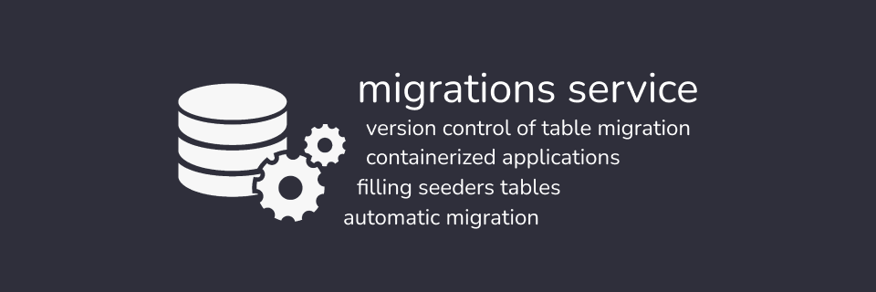

## Overview

The service solves such tasks as automatic migration, filling seeders tables and version control of table migration in the infrastructure of containerized applications.

## Licence

[MIT](https://github.com/Zubogain/sequelize-service/blob/main/LICENSE)
